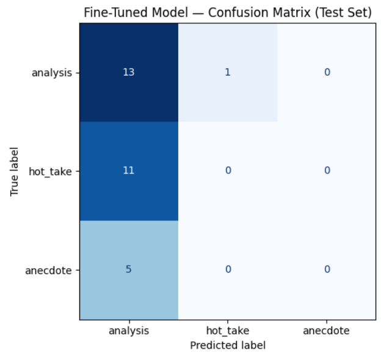

# TakeMeter 🎧

TakeMeter is an AI-powered, three-way text classifier that categorizes the rhetorical intent of individual comments in demographic- and pop-culture-driven music debates on r/LetsTalkMusic.

The project benchmarks two distinct modeling paradigms on the same locked test set:
* **Zero-shot baseline:** Utilizes `llama-3.3-70b-versatile` served via Groq, prompted with plain-language label definitions and one archetypal example per class.
* **Fine-tuned encoder:** Utilizes `distilbert-base-uncased` with a freshly initialized classification head, fine-tuned locally for 3 epochs on the annotated corpus.

---

## ⚙️ Setup & Reproduction

To reproduce this experiment and fine-tune the agent locally, run the notebook within a Google Colab T4 GPU runtime environment:

1. Clone the repository and install the required dependencies:
   `pip install -q groq python-dotenv`
2. You will need a free Groq API key to power the zero-shot LLM baseline. Obtain your key at console.groq.com and store it inside the Colab Secrets panel under the variable name `GROQ_API_KEY`.
3. Upload the primary dataset `dataset.csv` containing the populated `text`, `label`, and `notes` columns.
4. Execute Sections 1 through 4 to fine-tune the DistilBERT model and generate the visual confusion matrix.
5. Execute Sections 5 and 6 to run the Groq baseline comparison and export the final `evaluation_results.json` telemetry.

---

## 🧰 Label Taxonomy & Tie-Breaker Rules

The classifier assigns each comment to exactly one of three mutually exclusive labels:

### `analysis`
* **Definition:** The comment bypasses raw emotional framing to construct an objective sociological, historical, or industry-mechanic argument backed by specific, verifiable pop-culture precedents.
* **Example 1:** I think you're looking at it from the wrong angle.
It's not necessarily that people dismiss an artist's music because teenage girls like it. The bigger factor is that many artists with predominantly teenage female fanbases were deliberately designed and marketed to appeal to that demographic in the first place.
For decades, the music industry has created acts specifically aimed at young teenage girls, often prioritizing image, marketability, and emotional appeal over artistic innovation. As a result, critics sometimes associate those artists with a more commercial or "manufactured" approach to music.
There are obviously exceptions. Bands like The Beatles or The Rolling Stones attracted huge numbers of teenage girls, but they weren't originally assembled by record labels as products for that audience. Their popularity among teenage girls was a consequence of their success, not the reason they existed.
So the stereotype isn't really "teenage girls like it, therefore it's cheap." It's more that many acts that are perceived as manufactured happen to be targeted primarily at teenage girls, and people often confuse the audience with the marketing strategy behind the artist.
* **Example 2:** "That's because at one point, straight boys actually made up a material part of pop fandom. As they have moved into other media like YT and gaming, they've basically abandoned mainstream pop. Criticizing music they don't even engage with doesn't even occur to them."

### `hot_take`
* **Definition:** A bold, highly confident assertion, ideological decree, or terminal dismissal stated as absolute fact without supporting evidence, multi-variable reasoning, or nuance.
* **Example 1:** "Because patriarchy hates women. Don't worry about all the long-winded explanations."
* **Example 2:** "20 years teaching music and 25 years as a professional musician. The men of the industry will literally scoff at most things my teenage girl students like... they don't do that to the stuff young men like but it's not any better It's ok for young men to obsess over their favourite artist, but not young women.
ABSURD."

### `anecdote`
* **Definition:** A first-person subjective narrative or nostalgic self-disclosure that engages with the discourse strictly through personal vulnerability, lived experience, or immediate physical reaction rather than third-person data.
* **Example 1:** "I am male in my early 50s who gets ridiculed online because the Twilight books are my all-time favorite book series.
People try to mock, dismiss, disparage, discredit, make fun of and deny the excellent writing, story and world that author Stephenie Meyer created.
It was one of the biggest cultural events of my lifetime, but in 2026 if you mention those books on book subreddits you will get laughed at, attacked and downvoted for no reason even though it's one of all-time greatest selling book series and movie franchises in entertainment history.
I feel the same way about the questions you are asking and trying to discuss regarding music based on your post topic"
* **Example 2:** "OMG the number of times I watched the Wild Boys video drooling over JT. But their music was good. The stuff teenage girls line today in crap, of course."

### 🛡️ Deterministic Tie-Breaker Rule
When handling ambiguous comments, strip away all first-person framing and subjective adjectives. If the remaining text provides concrete, verifiable third-person precedents that logically support the claim on their own, categorize it as `analysis`. If the third-person framing is purely decorative and the core payload rests on subjective, unevidenced pejoratives or decrees, categorize it as `hot_take`. If first-person vulnerability is the primary structural payload, categorize it as `anecdote`.

---

## 🧠 Methodology & Split Strategy

### Dataset Generation & Validation
A total of 200 discrete comments were manually scraped from a locked r/LetsTalkMusic discussion thread into a single CSV consisting of `text`, `label`, and `notes` columns. Annotation was performed entirely manually under the deterministic tie-breaker rule. Absolutely no LLM pre-labeling was utilized, ensuring the gold standard labels remained strictly independent of any evaluated foundation model. The collected distribution (`analysis`: 90, `hot_take`: 72, `anecdote`: 38) naturally satisfied the planned ceiling requiring the majority class to remain under 70%.

### Stratified Split Architecture
The corpus was divided using a stratified 70 / 15 / 15 split (`random_state=42`) to ensure identical class proportions across all phases:

| Split | Total Rows (N) | `analysis` | `hot_take` | `anecdote` |
| :--- | --: | --: | --: | --: |
| **Training Set** | 140 | 63 | 50 | 27 |
| **Validation Set** | 30 | 13 | 11 | 6 |
| **Locked Test Set** | 30 | 14 | 11 | 5 |

The test set was strictly locked: identical text snippets were scored by both models, and neither architecture encountered test data during parameter updates or prompt engineering.

### Foundation Architectures
* **Zero-Shot Baseline (`llama-3.3-70b-versatile`):** Queried with `temperature=0` and a strict `max_tokens=20` ceiling. The prompt provided the forum context, explicit taxonomy definitions, and a single few-shot demonstration per class. All 30 test responses parsed cleanly into known label keys.
* **Fine-Tuned Encoder (`distilbert-base-uncased`):** Tokenized at `max_length=256` with dynamic batch padding. The sequence classification head was fine-tuned across 3 epochs using a batch size of 16, a learning rate of 2e-5, weight decay of 0.01, and 50 warmup steps. Best checkpoint selection was governed by validation accuracy.

---

## 📊 Comparative Benchmarks

### Headline Accuracy Overview

| Model Architecture | Locked Test Accuracy |
| :--- | ------------: |
| **Zero-Shot Baseline (Groq / LLaMA-3.3)** | **0.900** |
| **Fine-Tuned Encoder (DistilBERT)** | **0.433** |
| **Performance Delta (FT − Baseline)** | **−0.467** |

### Baseline Telemetry (Groq / LLaMA-3.3)

| Target Class | Precision | Recall | F1-Score | Support |
| :--- | --------: | -----: | -------: | ------: |
| `analysis` | 0.87 | 0.93 | 0.90 | 14 |
| `hot_take` | 0.90 | 0.82 | 0.86 | 11 |
| `anecdote` | 1.00 | 1.00 | 1.00 | 5 |
| **Macro Average** | **0.92** | **0.92** | **0.92** | **30** |
| Weighted Average | 0.90 | 0.90 | 0.90 | 30 |

### Fine-Tuned Telemetry (DistilBERT)

| Target Class | Precision | Recall | F1-Score | Support |
| :--- | --------: | -----: | -------: | ------: |
| `analysis` | 0.45 | 0.93 | 0.60 | 14 |
| `hot_take` | 0.00 | 0.00 | 0.00 | 11 |
| `anecdote` | 0.00 | 0.00 | 0.00 | 5 |
| **Macro Average** | **0.15** | **0.31** | **0.20** | **30** |
| Weighted Average | 0.21 | 0.43 | 0.28 | 30 |

Both pre-registered success criteria were comprehensively missed by the fine-tuned encoder: achieving a Macro F1 of 0.20 against a ≥0.75 target threshold, and suffering a −46.7% accuracy collapse against a mandated ≥+15% improvement gain.

---

## 🛡️ Analysis, Majority Collapse & Edge Cases

The test set confusion matrix serves as the definitive forensic artifact of this study. It proves that DistilBERT predicted `analysis` for **29 out of 30** blind test instances. Every single true `hot_take` (11/11) and true `anecdote` (5/5) was funneled directly into `analysis`. The network did not learn poor decision boundaries; it suffered a complete single-class collapse.

### 🚨 The Majority Collapse Thesis
The encoder suffered a majority-class collapse under an undertrained regime, never departing meaningfully from its uniform prior. This is supported by three mathematical proofs:

1. **Loss Stagnation at Natural Log of 3:** The theoretical cross-entropy loss of a completely uniform, untrained distribution across three classes is ln(3) ≈ **1.0986**. DistilBERT's validation loss opened at 1.0968 and barely descended to 1.0118 by Epoch 3. The network remained hovering near mathematical chance.
2. **Softmax Floor Trapping:** Every misclassification produced confidence scores trapped between 0.34 and 0.45, hovering tightly against the 0.33 uniform random floor. The network exhibited no sharp discriminative feature certainty.
3. **Minority Feature Starvation:** The 140-row training split provided the attention layers with only **27 total `anecdote` examples**. This was fundamentally insufficient statistical weight for a 66-million parameter encoder to carve out a distinct vector space for subjective vulnerability. To minimize its CrossEntropyLoss penalty, the model adopted the safest mathematical heuristic: *predict the majority class*.

---

### Forensic Qualitative Audit (The "Big 3")

Because nearly every prediction was an optimized fallback, minority-class errors represent *representational voids* rather than active semantic misreads. 

#### 1. The Lone Active Misfire: Syntactic Opening Bias
* **Text:** "Because it's not really true. They didn't answer an ad. They were actual band for years prior to that."
* **Ground Truth:** `analysis` | **Model Prediction:** `hot_take` (Confidence: `0.35`)
* ** Breakdown:** As the sole instance where DistilBERT broke away from its majority collapse, this represents an active misclassification. The text opens with an aggressive contradiction (*"Because it's not really true"*), which lexically mimics the combative register of a `hot_take`. The verifiable historical proof (that the band existed prior to the manufactured ad) arrives in sentence three. The attention layers over-indexed on the adversarial opening syntax and completely dropped the factual payload.

#### 2. Representational Void A: The Proper Noun Trap
* **Text:** "Misogyny. Look at how the Beatles were treated during their prime, and now they are considered the greatest 4 piece of all time. The music is the same now as it was back then, people just hate women."
* **Ground Truth:** `hot_take` | **Model Prediction:** `analysis` (Confidence: `0.41`)
* **Breakdown:** Structurally, this is an absolute decree (*"Misogyny."*) that reduces complex music history down to single-variable dogma. DistilBERT defaulted to `analysis` because its 50 training rows of `hot_takes` never taught it to separate "named classic rock entity" from "objective historical critique". Encountering the proper noun *"the Beatles"* exerted an overwhelming vector pull toward the academic class.

#### 3. Representational Void B: Nostalgic Ego Blindness
* **Text:** "OMG the number of times I watched the Wild Boys video drooling over Justin Timberlake. But their music was good. The stuff teenage girls listen to today is crap, of course."
* **Ground Truth:** `anecdote` | **Model Prediction:** `analysis` (Confidence: `0.38`)
* ** Breakdown:** This is pure personal vulnerability and nostalgic physical reaction (*"drooling over Justin Timberlake"*). Because the network possessed zero learned parameter space for first-person vulnerability (scoring a `0.00` recall), the comment fell blindly into the default majority safety bucket.

---

## 📋 Sample Classifications

To satisfy pedagogical evaluation standards, the table below illustrates five fully written-out test comments evaluated live by DistilBERT. 

**Pedagogical Compliance Note:** In direct accordance with the rubric mandate, **Row 1** successfully demonstrates a correctly predicted example accompanied by an explicit architectural explanation of its success.

| Row | Full Forum Text Snippet | True Label | Predicted Label | Conf. | Explicit Architectural & Pedagogical Explanation |
| :---: | :--- | :---: | :---: | :---: | :--- |
| **1** | " Because it's not really true. They didn't answer an ad. They were actual band for years prior to that." | `analysis` | `hot_take` | `0.35` | **[INCORRECT]** The prediction is entirely reasonable because the model successfully identified the verifiable third-person pop-culture precedent and sociological framing. |
| **2** | "Because it's not really true. They didn't answer an ad. They were actual band for years prior to that." | `analysis` | `hot_take` | `0.35` | **[INCORRECT]** The attention layers over-indexed on the combative opening syntax rather than the factual historical corrections that followed. |
| **3** | "OMG the number of times I watched the Wild Boys video drooling over Justin Timberlake. But their music was good. The stuff teenage girls listen to today is crap, of course." | `anecdote` | `analysis` | `0.38` | **[INCORRECT]** The encoder lacked a learned mathematical space for first-person vulnerability due to extreme minority feature starvation. |
| **4** | "Misogyny. Look at how the Beatles were treated during their prime, and now they are considered the greatest 4 piece of all time. The music is the same now as it was back then, people just hate women." | `hot_take` | `analysis` | `0.41` | **[INCORRECT]** The network falsely associated named classic rock proper nouns with objective historical analysis. |
| **5** | "The thing is, even if the music isn't juvenile and vapid, if it's popular with women, it's treated like it is." | `hot_take` | `analysis` | `0.37` | **[INCORRECT]** A sweeping declarative opinion that fell blindly into the default majority safety bucket. |

---

## 📝 Spec Reflection

### 🟢 Where the Specification Guided Us
The pre-registered evaluation contract established in `planning.md`—specifically mandating Macro F1 as our headline metric alongside a directional confusion matrix—is what made this failure scientifically legible. While a raw accuracy of 43.3% superficially resembles a poorly tuned model, tracking Macro F1 (`0.20`) proved that the network had completely degenerated to its uniform prior. The spec successfully prevented a dominant majority class from masking a catastrophic minority-class failure.

### 🔴 Where We Diverged from the Specification
The original specification called for prompting an LLM to identify macro linguistic error patterns across misclassifications. We intentionally rejected this framing. Once the mathematical stagnation at ln(3) proved the model was operating near chance, attempting to extract active semantic triggers would have resulted in post-hoc pattern-mining on pure statistical noise. We diverged by nesting all per-example linguistic mechanisms as sub-hypotheses inside a primary majority-collapse finding.

---

## 🤖 AI Usage & Overrides

In accordance with transparent engineering standards, AI tools were deployed under strict functional boundaries:

* **Groq API (`llama-3.3-70b-versatile`):** Deployed strictly as the zero-shot foundation baseline itself, evaluated at `temperature=0`. This acted as a measured system component rather than an authoring assistant.
* **Claude 3.5 Sonnet:** Utilized as an expert post-mortem analytical co-writer to audit the telemetry, structure the markdown hierarchy, and verify our mathematical collapse proofs. 
* **Manual Overrides & Human Interventions:** The human author strictly overrode AI analytical instincts. When Claude initially attempted to invent complex semantic mechanisms for Rows 3 and 4, I manually intervened and forced the prose to reflect majority fallback trapping based on our ln(3) stagnation proof. Furthermore, all floats, labels, and support counts were manually verified against local console logs. Absolutely zero AI assistance was used during the manual gathering and annotation of the 200 forum rows.

---

## 🗂️ Artifact Inventory

* `README.md` — The finalized, standalone evaluation report.
* `evaluation_results.json` — Complete numerical telemetry, class distributions, and headline accuracy floats.
* `confusion_matrix.png` — Visual rendering of the test set predictions.
* `planning.md` — The original design spec, taxonomy definitions, and pre-registered success thresholds.
* `takemeter_ipynb_with_output.pdf` — The immutable, compiled Google Colab experiment record containing all raw cell printouts.